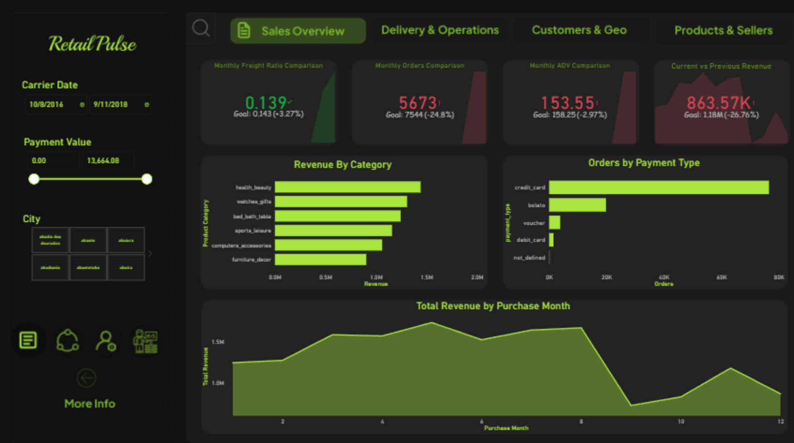
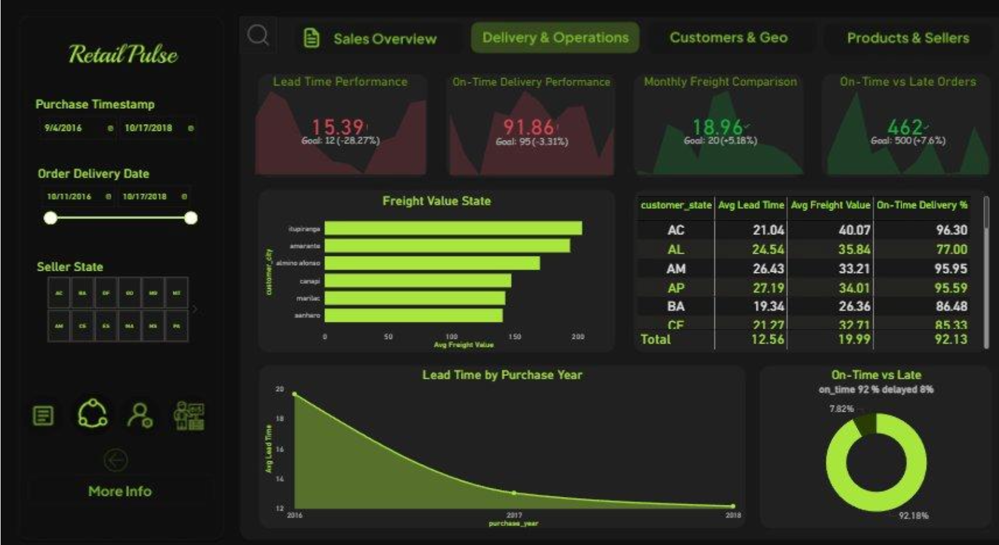
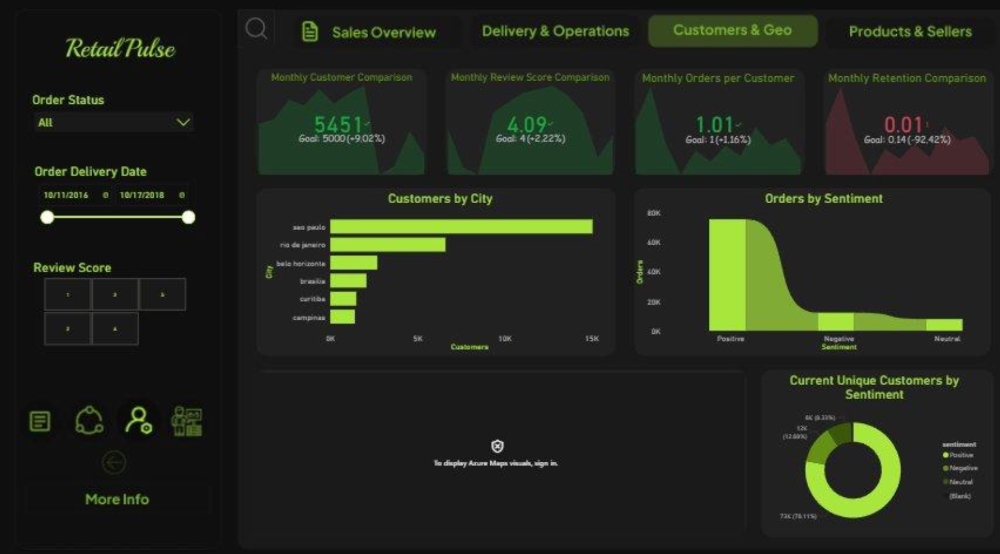
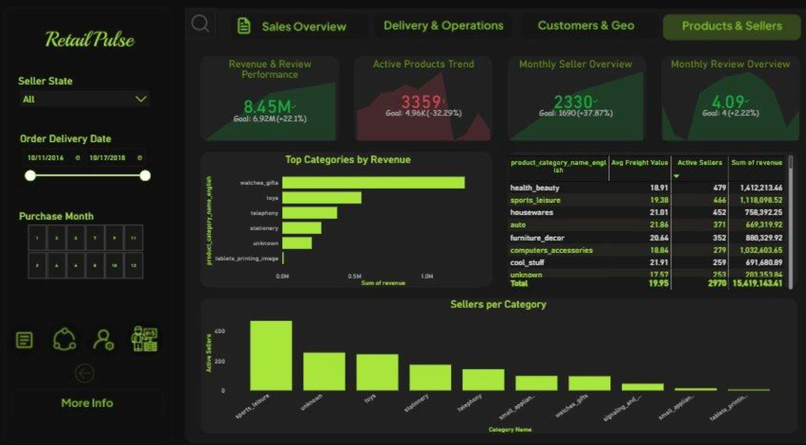

# Retail Pulse | Olist Brazilian E-Commerce Executive Performance Report

## 🖥️ Dashboard Interface Previews

### 1. Sales & Revenue Overview

### 2. Delivery & Logistical Operations

### 3. Customer Analytics & Geographic Density

### 4. Product Health & Marketplace Sellers

## 📌 Project Overview
This project provides an end-to-end business intelligence solution analyzing approximately **100,000 orders** from the Olist Marketplace in Brazil spanning **2016–2018**. The interactive Power BI dashboard provides executive visibility into the entire e-commerce funnel, core operational logistics, customer sentiment distribution, and individual product health metrics.

---

## 🛠️ Core Architecture & Pipeline

### 1. Data Preprocessing (Python)
The data went through a production-grade ETL pipeline developed using Python and Pandas. The preprocessing stages included:
* **Structural Verification:** Loading and checking datatypes across 9 relational tables.
* **Datetime Normalization:** Standardizing time-based strings into operational datetime indices.
* **Data Cleansing:** Handling missing text comments and utilizing strategic imputation constraints.
* **Outlier Treatment:** Capping financial variables (prices and freights) at the 99th percentile to avoid skewed business logic.
* **Feature Engineering:** Calculating end-to-end delivery performance metrics and generating threshold-based late delivery flags.

### 2. Data Modeling (Power BI Star Schema)
Cleaned datasets were imported into Power BI and organized into an optimized **Star Schema** to ensure fast, responsive cross-filtering:
* **Fact Tables:** `orders`, `order_items`
* **Dimension Tables:** `customers`, `products`, `sellers`, `payments`, `reviews`
* **Calendar Dimension:** A custom DAX-generated `Calendar` table linked to order purchase timestamps to facilitate time-intelligence reporting.
* **Relationships:** Configured 1-to-Many ($1:\infty$) relationships with single-directional cross-filtering to optimize query performance.

---

## 📈 Key Metrics & DAX Formulas

The executive dashboard tracks performance against predefined operational goals using custom DAX expressions:

* **Total Revenue vs. Goal:** Tracks absolute financial intake against organizational projections.
    * *Result:* **$863.57K** achieved against a **$1.18M** goal (-26.76% variance).
    * *DAX:* `Total Revenue = SUM(order_payments[payment_value])`
* **Total Orders:** Measures gross market transaction volume.
    * *Result:* **5,673 Orders** (-24.8% below baseline target of 7,544).
    * *DAX:* `Total Orders = DISTINCTCOUNT(orders[order_id])`
* **On-Time Delivery Rate:** Quantifies fulfillment efficiency.
    * *Result:* **92.18% On-Time** (7.82% delayed volume).
    * *DAX:* `On-Time Delivery Rate = DIVIDE(CALCULATE(COUNT(orders[order_id]), orders[is_late] = 0), COUNT(orders[order_id]), 0)`
* **Positive Sentiment Rate:** Evaluates baseline customer satisfaction.
    * *Result:* **78.11% Positive Sentiment** (~76K total reviews).
    * *DAX:* `Positive Sentiment Rate = DIVIDE(CALCULATE(COUNT(reviews[review_id]), reviews[review_score] >= 4), COUNT(reviews[review_id]), 0)`
* **Average Order Value (AOV):** Tracks per-transaction customer spend behavior.
    * *DAX:* `AOV = DIVIDE([Total Revenue], [Total Orders], 0)`

---

## 🖥️ Dashboard Interface Layout (4 Pages)

1. **Sales Overview:** Tracks higher-level revenue trends, performance scorecards, AOV changes, and top performing macro-product categories.
2. **Delivery & Operations:** Isolates logistical delivery lag times, operational transit lead times, and deep regional freight value variations across states.
3. **Customers & Geo:** Explores geographic user concentration maps, customer retention segments, and review comment sentiment classification.
4. **Products & Sellers:** Evaluates marketplace seller densities, active cross-category distributions, and advanced revenue-per-review indices.

---

## 📂 Dataset Attribution
The underlying analytical records originate from the **Brazilian E-Commerce Public Dataset by Olist** hosted on Kaggle. You can review the raw operational data schema here: [Olist Dataset on Kaggle](https://www.kaggle.com/datasets/olistbr/brazilian-ecommerce).
